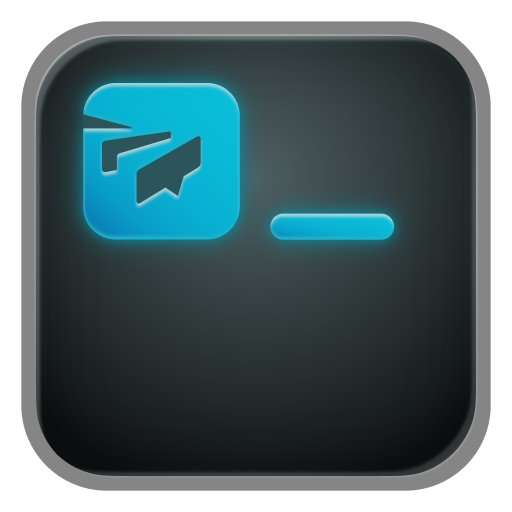

<p align="center">
  
</p>

# Twist CLI

A command-line interface for Twist.

## Installation

> ```bash
> npm install -g @doist/twist-cli
> ```

### Local Setup (for now)

```bash
git clone https://github.com/Doist/twist-cli.git
cd twist-cli
npm install
npm run build
npm link
```

This makes the `tw` command available globally.

## Setup

Set up your Twist API token:

```bash
tw auth login
```

## Usage

```bash
tw inbox                           # inbox threads
tw inbox --unread                  # unread threads only
tw thread view <ref>               # view thread with comments
tw thread view <ref> --comment 123 # view a specific comment
tw thread reply <ref>              # reply to a thread
tw conversation unread             # list unread conversations
tw conversation view <ref>         # view conversation messages
tw msg view <ref>                  # view a conversation message
tw search "keyword"                # search across workspace
tw react thread <ref> 👍          # add reaction
```

References accept IDs (`123` or `id:123`), Twist URLs, or fuzzy names (for workspaces/users).

Run `tw --help` or `tw <command> --help` for more options.

## Shell Completions

Tab completion is available for bash, zsh, and fish:

```bash
tw completion install        # prompts for shell
tw completion install bash   # or: zsh, fish
```

Restart your shell or source your config file to activate. To remove:

```bash
tw completion uninstall
```

### Machine-readable output

All list/view commands support `--json` and `--ndjson` flags for scripting:

```bash
tw inbox --json                    # JSON array
tw inbox --ndjson                  # newline-delimited JSON
tw inbox --json --full             # include all fields
```

## Development

```bash
npm install
npm run build       # compile
npm run dev         # watch mode
npm run type-check  # type check
npm run format      # format code
npm test            # run tests
```
